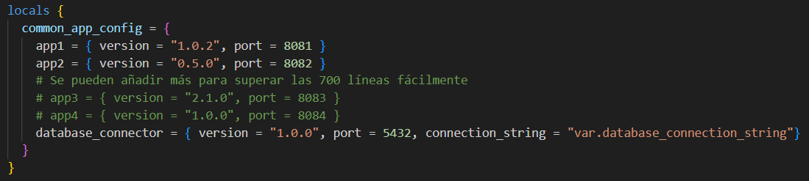
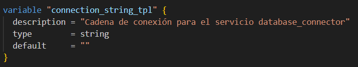
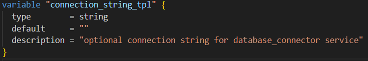
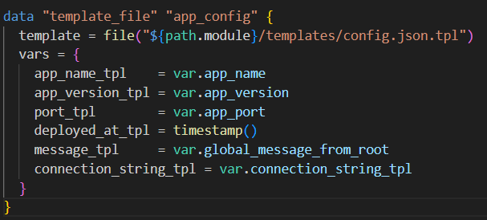
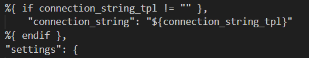
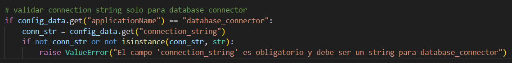
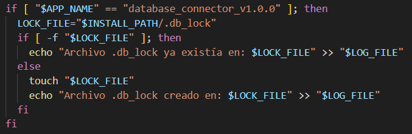
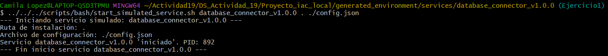
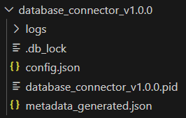

### Actividad : Orquestador local de entornos de desarrollo simulados con Terraform

#### Ejercicios

1.  **Ejercicio de evolvabilidad y resolución de problemas:**

    Añadimos un nuevo "servicio" llamado `database_connector` a `local.common_app_config` en `main.tf`. 

    1.  Modifica `main.tf` para incluir `database_connector`
    En la sección de locals, en common_app_config añadimos la definición de database_connector con su propia versión, puerto y un nuevo parámetro `connection_string`. Este último valor lo referenciamos como var.database_connection_string.
    
        
    
        También declaramos la variable connection_string_tpl en `variables.tf` dentro de un bloque variable. Esta variable corresponde a la cadena de conexión para el servicio database_connector.
    
        
    
    2.  Modifica el módulo `application_service`:
        Añadimos la nueva variable `connection_string_tpl` en `application_service/variables.tf`.
            
         Actualizamos el módulo application_service para integrar la nueva variable connection_string_tpl en el contexto de la plantilla config.json.tpl.
            
        
        También actualizamos `config.json.tpl` para incluir este nuevo campo.  Hacemos que el connection_string se agregue solo si la variable correspondiente no está vacía.
            

    3.  Actualizamos el script `validate_config.py` para que verifique la presencia y formato básico de `connection_string` solo para el servicio `database_connector`.
        

    * **Reto adicional:** Modificamos`start_simulated_service.sh` para que cree un archivo `.db_lock` si el servicio es `database_connector`.
    
    
        Ejecutamos `start_simulated_service.sh`
    
    
        Observamos la correcta creación del archivo `.db_lock` después de la ejecución
        
        

2.  **Ejercicio de refactorización y principios:**

      * **Tarea:** Actualmente, el `generate_app_metadata.py` se llama para cada servicio. Imagina que parte de los metadatos es común a *todos* los servicios en un "despliegue" (ej. un `deployment_id` global).
      * **Pasos:**
        1.  Crea un nuevo script Python, `generate_global_metadata.py`, que genere este `deployment_id` (puede ser un `random_uuid`).
        2.  En el `main.tf` raíz, usa `data "external"` para llamar a este nuevo script UNA SOLA VEZ.
        3.  Pasa el `deployment_id` resultante como una variable de entrada al módulo `application_service`.
        4.  Modifica `generate_app_metadata.py` y/o `config.json.tpl` dentro del módulo `application_service` para que incorpore este `deployment_id` global.
      * **Discusión:** ¿Cómo mejora esto la composabilidad y reduce la redundancia? ¿Cómo afecta la idempotencia?

3.  **Ejercicio de idempotencia y scripts externos:**

      * **Tarea:** El script `initial_setup.sh` crea `placeholder_$(date +%s).txt`, lo que significa que cada vez que se ejecuta (si los `triggers` lo permiten), crea un nuevo archivo.
      * **Pasos:**
        1.  Modifica `initial_setup.sh` para que sea más idempotente: antes de crear `placeholder_...txt`, debe verificar si ya existe un archivo `placeholder_control.txt`. Si no existe, lo crea y también crea el `placeholder_...txt`. Si `placeholder_control.txt` ya existe, no hace nada más.
        2.  Ajusta los `triggers` del `null_resource "ejecutar_setup_inicial"` en el módulo `environment_setup` para que el script se ejecute de forma más predecible (quizás solo si una variable específica cambia).
      * **Reto adicional:** Implementa un "contador de ejecución" en un archivo dentro de `generated_environment`, que el script `initial_setup.sh` incremente solo si realmente realiza una acción.

4.  **Ejercicio de seguridad simulada y validación:**

      * **Tarea:** El `mensaje_global` se marca como `sensitive` en `variables.tf`. Sin embargo, se escribe directamente en `config.json`.
      * **Pasos:**
        1.  Modifica el script `validate_config.py` para que busque explícitamente el contenido de `mensaje_global` (que el estudiante tendrá que "conocer" o pasar como argumento al script de validación) dentro de los archivos `config.json`. Si lo encuentra, debe marcarlo como un "hallazgo de seguridad crítico".
        2.  Discute cómo Terraform maneja los valores `sensitive` y cómo esto se puede perder si no se tiene cuidado al pasarlos a scripts o plantillas.
        3.  (Opcional) Modifica la plantilla `config.json.tpl` para ofuscar o no incluir directamente el `mensaje_global` si es demasiado sensible, tal vez solo una referencia.
